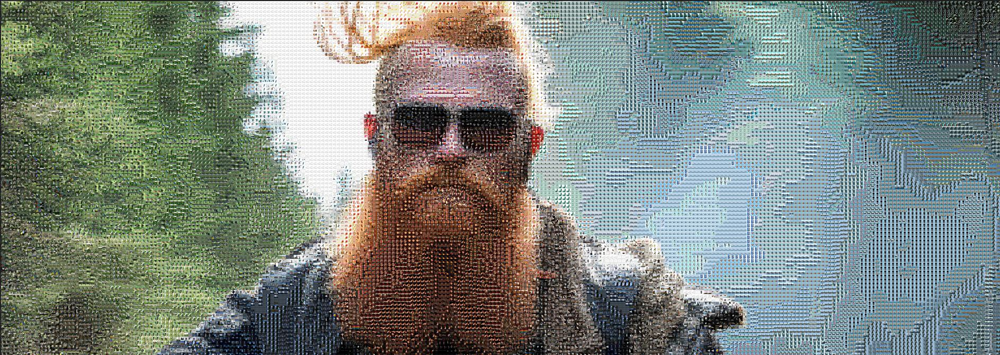
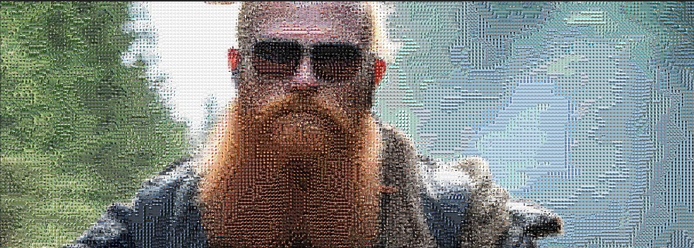
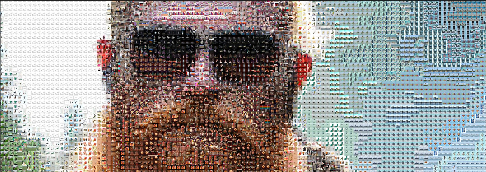
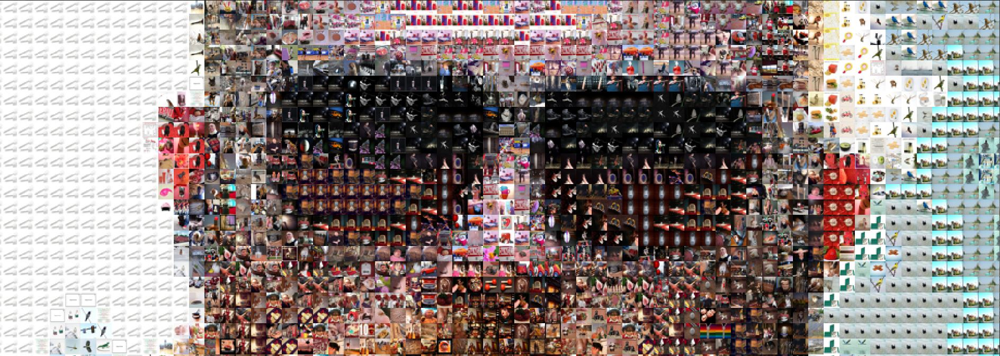

# Project Artistic
This project aims at testing diffrent ideas of AI for project artistic: Evolution  
# Table of contents
- [Installation](#installation)
  - [Get tile photos](#get-tile-photos)
  - [Python dependencies](#python-dependencie)
- [Run pipeline](#run-pipeline)
  - [instruction](#instruction)
  - [examples](#examples)

# Installation
## Get input data

### tile photos
The tile photos are real images that are used to reconstruct the image photo realistic by find the closest color. 
In order to get the maximum diversity of colors, we choose the dataset ImageNet, which contains 20k images through 
1000 classes.

### image photo realistic 
The image photo realistic is generated first by [midjourney](https://www.midjourney.com/home/?callbackUrl=%2Fapp%2F) then upsampling
using [replicate](https://replicate.com/collections/super-resolution). This allows to upscale the input image til to 10x.
To inference a super-resolution model  using replicate cloud, you should log in your personal ``github`` account.  

### How to get
To donwload the **tile photos** and **examples of image photo realistic 8k**: [google drive](https://drive.google.com/drive/folders/1eQLRoQR2Of8IW0Fh3EY6g9toGzjVgDft?usp=share_link) 

## Python dependencies

```
git clone https://github.com/Cyzcyz11473/project_artistic.git
cd project_artistic
poetry install 
```

# Run pipeline

## instruction 
To run pipeline:

```
poetry run python project_artiscit/Mosaic/main.py --path_photos [PATH_TO_IMAGE_8K] --path_tile_photos [PATH_TO_TILE_PHOTOS] --output_path [OUTPUT_IMAGE_PATH] --tile_size [TILE_IMAGE_SIZE] 
```

Tu run mosaic.exe:
```
.\exe\mosaic.exe --path_photos [PATH_TO_IMAGE_8K] --path_tile_photos [PATH_TO_TILE_PHOTOS] --output_path [OUTPUT_IMAGE_PATH] --tile_size 20,20 
```

## examples
Output image is (6912, 6912), generated by tile photo (15, 15). 

|  
|:---------------------------------------------:| 
|             *Image ScreenShot 1*              |

|  
|:----------------------------------------------:| 
|           *Image ScreenShot 2 zoom*            |

|  
|:--------------------------------------------:| 
|          *Image ScreenShot 3 zoom+*          |

|  
|:--------------------------------------------:| 
|         *Image ScreenShot 3 zoom++*          |